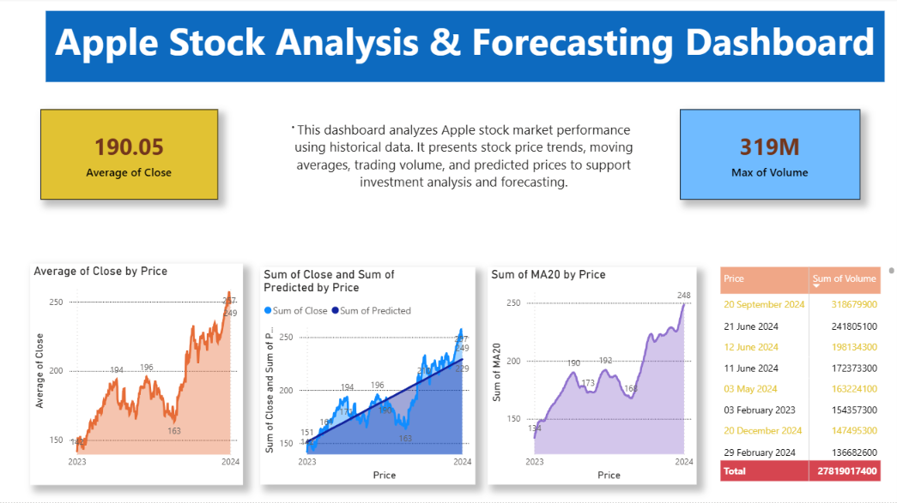

<div align="center">

# 🍎 Apple Stock Analysis & Forecasting Dashboard


</div>

---

## 📌 Project Overview

This project analyzes Apple Inc. stock market performance using historical stock data. The workflow combines Python for data analysis, MySQL for data management, and Power BI for interactive dashboard creation and forecasting visualization.

The dashboard provides insights into:

- Stock price trends
- Trading volume analysis
- Moving average (MA20) analysis
- Actual vs Predicted stock prices
- Market forecasting insights

---

## 🛠️ Technologies Used

<p align="center">
  
  &nbsp;&nbsp;&nbsp;
  
  &nbsp;&nbsp;&nbsp;
  
  &nbsp;&nbsp;&nbsp;
  
</p>

### Tools & Libraries
- Python
- Pandas
- NumPy
- Matplotlib
- MySQL
- Power BI
- GitHub

---

## 📊 Dashboard Preview



---

## 📈 Key Metrics

| Metric | Value |
|----------|----------|
| Average Closing Price | 190.05 |
| Maximum Trading Volume | 319 Million |
| Moving Average | MA20 |
| Forecasting | Actual vs Predicted |

---

## 📂 Repository Structure

```text
apple-stock-analysis-dashboard
│
├── Apple_Stock_Analysis_Dashboard.pbix
├── stock_analysis.ipynb
├── apple_stock_data.csv
├── apple_stock_queries.sql
├── apple_stock_dashboard.png.png
└── README.md
```

---

## 🔍 Project Workflow

### 1️⃣ Data Collection
- Imported Apple stock historical data.
- Stored and managed data using MySQL.

### 2️⃣ Data Analysis
- Cleaned and processed data using Python.
- Performed exploratory data analysis (EDA).
- Calculated moving averages and trends.

### 3️⃣ SQL Analysis
- Highest trading volume day.
- Average closing price.
- Data aggregation and filtering.

### 4️⃣ Dashboard Development
- Created KPI Cards.
- Built Trend Analysis Charts.
- Added Forecasting Visualization.
- Added Trading Volume Insights.

---

## 📉 Dashboard Features

### 📌 KPI Cards
- Average Closing Price
- Maximum Trading Volume

### 📌 Trend Analysis
- Closing Price Trends
- Stock Performance Over Time

### 📌 Forecasting
- Actual Price vs Predicted Price

### 📌 Moving Average Analysis
- MA20 Trend Visualization

### 📌 Volume Analysis
- Highest Trading Volume Days

---

## 🎯 Business Insights

- Apple stock shows a strong upward trend.
- Trading volume reached a peak of 319 Million shares.
- Predicted values closely follow actual stock movement.
- Moving Average analysis confirms long-term growth trends.

---

## 👨‍💻 Author

### SAI VAMSHI MIRYALKAR

🔗 GitHub: https://github.com/vijaymotam551-boop

---

<div align="center">

### ⭐ If you like this project, give it a Star ⭐

</div>
